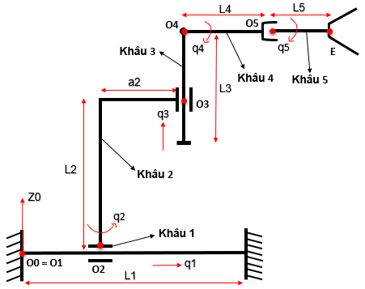
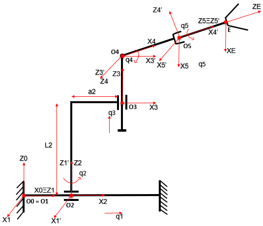
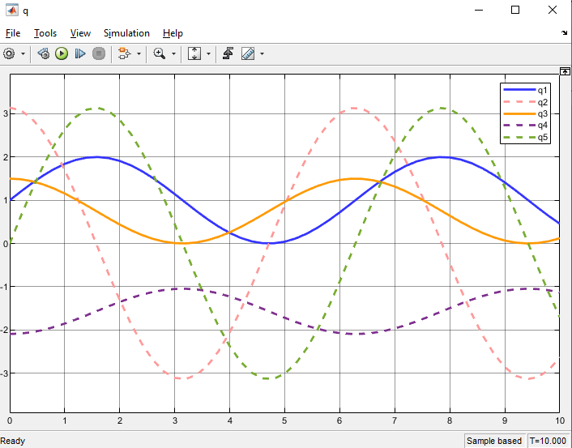
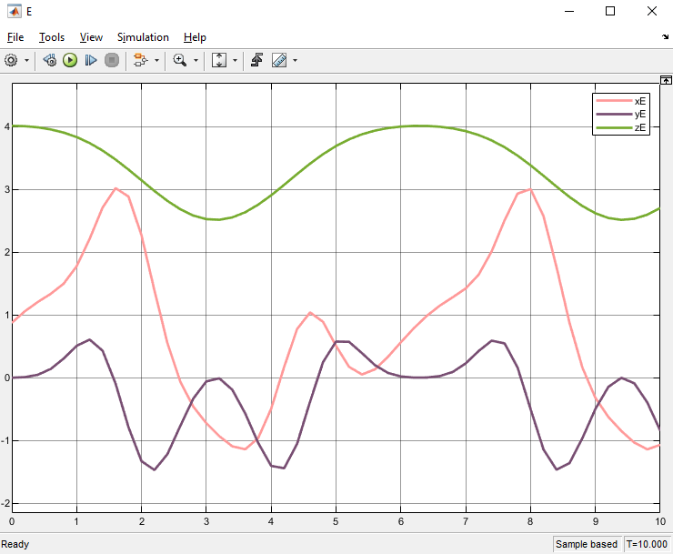
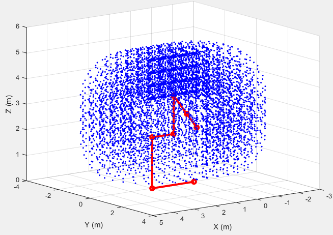
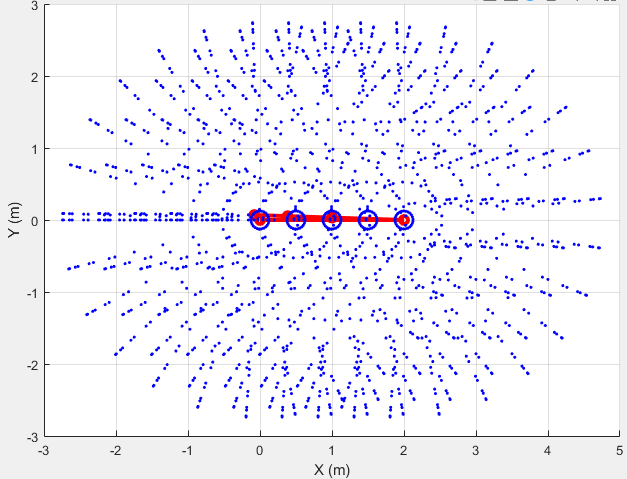
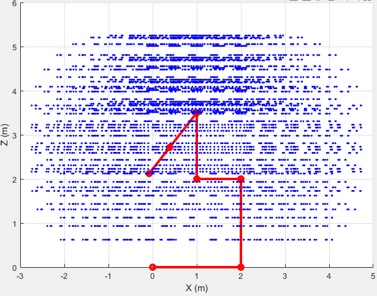
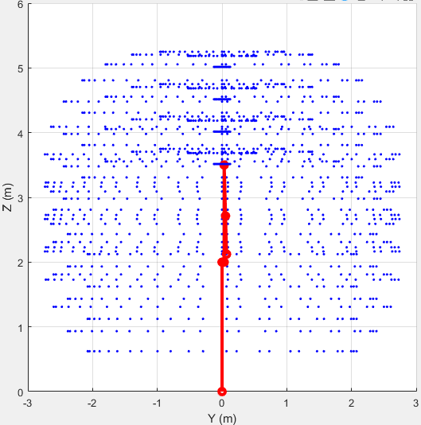
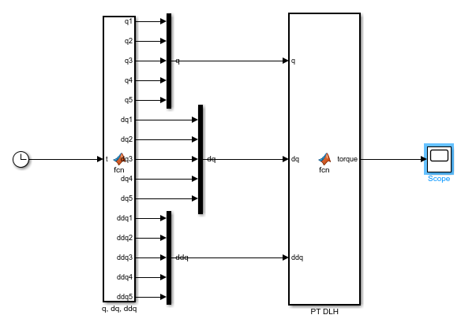
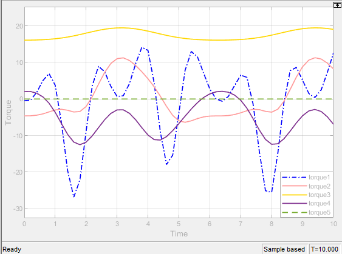

# 5-DOF Robot Arm: Kinematics, Path Planning & Dynamics

This project models a 5-DOF robot arm whose joints are **P–R–P–R–R**. It covers:

- the arm's mathematical model, built with the Denavit–Hartenberg (DH) convention
- forward and inverse kinematics
- the arm's reachable workspace
- joint-space trajectory planning
- inverse dynamics

The math is derived in **Maple** and simulated in **MATLAB / Simulink**. This is the group project for *Kinematics & Dynamics of Robots* (RBE2003, VNU University of Engineering and Technology, 2022), Group 21, Problem 21.

<p align="center">
  
  
</p>

## Robot model

| Joint | Type | Variable | Range used for the workspace |
|:--:|--|:--:|:--:|
| 1 | prismatic, slides along link 1 | `q1` (m) | 0 → 2 |
| 2 | revolute, rotates about link 2 | `q2` (rad) | −π → π |
| 3 | prismatic, vertical | `q3` (m) | 0 → 1.5 |
| 4 | revolute hinge | `q4` (rad) | −2π/3 → π/3 |
| 5 | revolute, rotates about link 5 | `q5` (rad) | does not move E |

**Link lengths:** L1 = 2 m, L2 = 2 m, a2 = 1 m, L3 = 1.5 m, L4 = 1 m, L5 = 0.75 m.

**Masses:** m1 = 2, m2 = 2, m3 = 1, m4 = 0.75, m5 = 0.5 kg. All link inertias are 10⁻⁴ kg·m².

Forward kinematics of the end-effector E:

```
xE = ((L4 + L5)·cos q4 + a2)·cos q2 + q1
yE = ((L4 + L5)·cos q4 + a2)·sin q2
zE = −(L4 + L5)·sin q4 + q3 + L2
```

## Repository layout

```
.
├── a-mathematicalizing/
│   ├── DatTrucDe21.pptx                   # drawings of the DH frame placement
│   └── DH_ToaDoCuoi_De21_RB5DOF_HT.mw     # Maple: DH matrices + end-effector position
├── b-kinematics/
│   ├── Động học thuận/PTDHT_2020a.slx     # Simulink: forward kinematics
│   ├── Động học ngược/                    # MATLAB: inverse kinematics
│   │   ├── DongHocNguoc.m                 #   main script
│   │   ├── DongHocThuan.m                 #   forward kinematics function
│   │   ├── TinhJnd.m                      #   Jacobian pseudo-inverse
│   │   ├── Quydao.m                       #   desired end-effector trajectory
│   │   └── parameter5DOF.m                #   link lengths
│   └── Không gian thao tác/MoPhong5DOF.m  # MATLAB: workspace simulation
├── c-path-plannings/
│   ├── QuyDaoLapTrinh_2020a.slx           # Simulink: trajectory + kinematics + inverse dynamics
│   └── Parameter5DOF.m                    # lengths, masses, inertias
├── d-dynamics/
│   ├── DHT_DLH_De21_RB5DOF_NHT_Matlabfriendly.mw  # Maple: M, C, G exported as MATLAB code
│   └── PTDLHN_2020a.slx                   # Simulink: inverse dynamics (q → torque)
├── DHT_DLH_De21_RB5DOF_NHT.mw             # Maple: full kinematics + dynamics derivation
├── Nhom21_BaoCao_AD_BC.docx               # full report (Vietnamese)
└── images/                                # figures from the report
```

## Requirements

- **MATLAB + Simulink R2020a or newer.** The `_2020a.slx` files were saved in R2020a.
- **Maple** to open the `.mw` worksheets. Maple is only needed to re-derive the equations; every simulation runs in MATLAB.

Before running anything, add every folder to the MATLAB path from the repository root. The scripts call helper functions that live in other folders.

```matlab
addpath(genpath(pwd))
```

## How to use

### 1. Mathematical model (Maple)

Open `a-mathematicalizing/DH_ToaDoCuoi_De21_RB5DOF_HT.mw` and run all (`!!!`). It builds the DH table and the transformation matrices H and D, and gives the end-effector position.

The report checks this result against hand geometry at three test poses, and they match. The root worksheet `DHT_DLH_De21_RB5DOF_NHT.mw` contains the same steps plus the dynamics.

### 2. Forward kinematics (Simulink)

Open and run `b-kinematics/Động học thuận/PTDHT_2020a.slx` (10 s). A MATLAB Function block generates the joint inputs:

```
q1 = sin t + 1          q2 = π·cos t           q3 = 0.75·(cos t + 1)
q4 = −(π/6)·cos t − π/2  q5 = π·sin t
```

The `q` scope plots the joint inputs. The `E` scope plots the end-effector coordinates xE, yE and zE.

### 3. Workspace

```matlab
cd 'b-kinematics/Không gian thao tác'
MoPhong5DOF
```

The script sweeps q1–q4 over the ranges in the joint table above. It animates the arm and plots every end-effector point it reaches.

### 4. Inverse kinematics

```matlab
cd 'b-kinematics/Động học ngược'
DongHocNguoc
```

- **Target path:** the end-effector follows a circle of radius 0.5 m in the plane x = 3.24 m, centred at z = 4.24 m. One lap takes 6 s (`Quydao.m`).
- **Start pose:** the script refines an initial guess for q with Newton–Raphson, to a tolerance of 1e-10.
- **Tracking:** the robot has 5 joints but only 3 position coordinates, so the Jacobian isn't square. The script steps along the path with the pseudo-inverse `J⁺ = Jᵀ(JJᵀ)⁻¹` (`TinhJnd.m`), and corrects q at each 0.1 s step to a tolerance of 1e-5.
- **Plots:**
  - Figure 1: joint values
  - Figure 2: end-effector position recomputed from q
  - Figures 3–5: x, y and z position error
  - Figure 6: 3D animation of the arm

### 5. Trajectory planning

Open and run `c-path-plannings/QuyDaoLapTrinh_2020a.slx` (10 s). Each joint follows a cubic polynomial that starts and ends at rest:

| Joint | q(0) | q(10 s) |
|:--:|:--:|:--:|
| q1 | 2 m | 5 m |
| q2 | π/3 | π/2 |
| q3 | 2 m | 3 m |
| q4 | π/6 | π/4 |
| q5 | 0 | 0 |

The model feeds the trajectory through forward kinematics and inverse dynamics. Its scopes show `q(t)`, `qdot`, `qdotdot`, the end-effector position `x` and velocity `dx`, and the joint `Torque`.

### 6. Dynamics

The equation of motion is

```
τ = M(q)·q̈ + C(q, q̇)·q̇ + G(q)
```

`d-dynamics/DHT_DLH_De21_RB5DOF_NHT_Matlabfriendly.mw` derives the following and exports M, C and G as MATLAB code:

- the centres of mass
- the translational and rotational Jacobians
- the mass matrix **M**, the Coriolis matrix **C** and the gravity vector **G**

To solve inverse dynamics (q → torque), open and run `d-dynamics/PTDLHN_2020a.slx`. It reuses the joint inputs from step 2 and their analytic derivatives. The robot parameters are written directly into the MATLAB Function block, so you don't need a parameter file.

The forward dynamics problem (torque → motion) is set up in the report but not simulated.

## Results

### Forward kinematics

| Joint inputs | End-effector trajectory |
|:--:|:--:|
|  |  |

The Simulink model is shown in [`images/fk-simulink.png`](images/fk-simulink.png).

### Workspace

The reachable space is roughly a rounded cylinder:
- about −2.7 to 4.7 m in x
- about ±2.7 m in y
- about 0.6 to 5.3 m in z

It's densest above the arm's shoulder.

| 3D | XY plane |
|:--:|:--:|
|  |  |
| **XZ plane** | **YZ plane** |
|  |  |

### Inverse dynamics

The plot shows the joint torques and forces over the 10 s run of the sinusoidal joint motion:
- **Joint 3 (vertical prismatic):** carries the arm's weight, so its force stays around 16–19 N.
- **Joints 1, 2 and 4:** oscillate with the motion. Joint 1 has the largest swings, about ±25 N.
- **Joint 5:** needs almost no torque, because its link's inertia is tiny.

| Simulink model | Joint torques / forces |
|:--:|:--:|
|  |  |

## Notes

- **Old figure:** the forward kinematics figure above came from an earlier model version that used `L2 = 1`. Every model now uses the report's `L2 = 2`, so re-running it gives a zE curve 1 m higher.
- **Trajectory vs. joint ranges:** the planned motion takes q1 to 5 m and q3 to 3 m. Both are past the ranges used in the workspace study.
- **Missing report sections:** the inverse kinematics (2.4) and trajectory planning (Ch. 3) sections of the report have headings only. Run the code above to get those results.

## Authors

| Name | Student ID | Responsible for |
|--|--|--|
| Nguyễn Huyền Trang | 20020727 | Mathematical model, dynamics, report |
| Phàn Huyền Trang | 20020728 | Forward & inverse kinematics, workspace |
| Lê Tuấn Tú | 20020729 | Trajectory planning |

Supervisor: Dr. Dương Xuân Biên.
